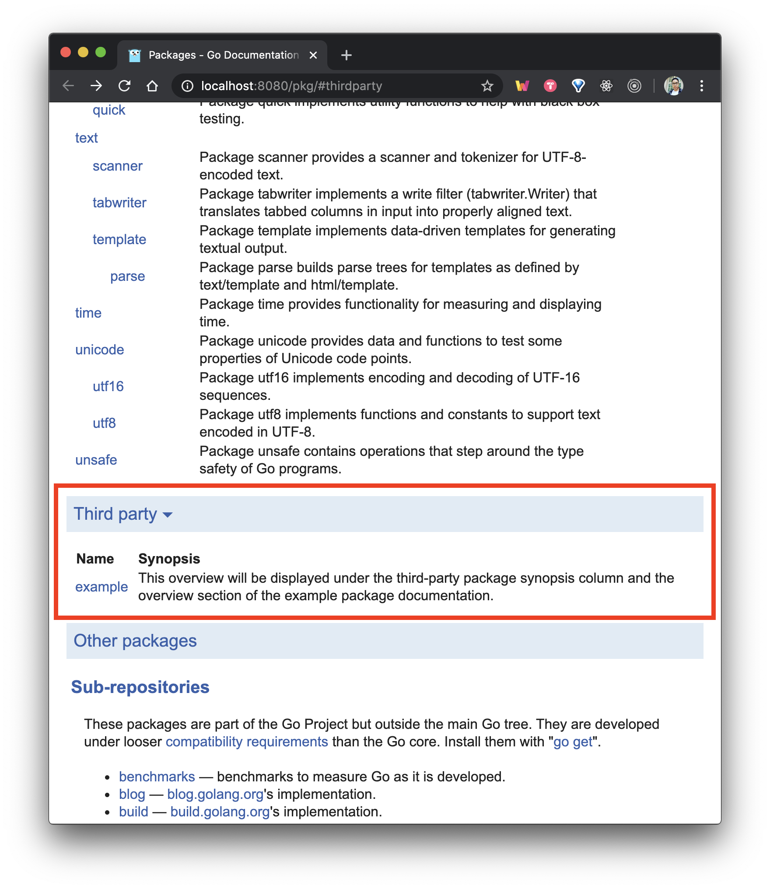

# Go Docs

View the official Go documentation offline and generate your custom project docs alongside it as third party packages. I created an image so you can do this outside the GOPATH. This is useful when using go modules https://github.com/golang/go/issues/26827.

[Docker Image on Docker Hub](https://hub.docker.com/r/ivorsco77/godocs)

## Setup

You are not required to have go modules initialized to get it working. Notice this repository does not have a go.mod file. Clone the repository anywhere on your machine, then run:

```
docker-compose up
```

Or in your own project use the docker run command

```
docker container run -v $(pwd):/go/src -p 8080:8080 ivorsco77/godocs
```



## Testable Examples

If you follow the right naming conventions you can display testable examples in the go docs https://blog.golang.org/examples.
